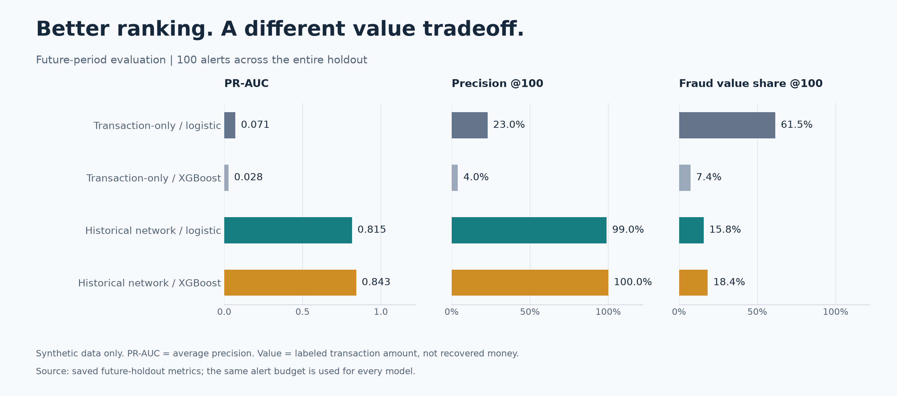
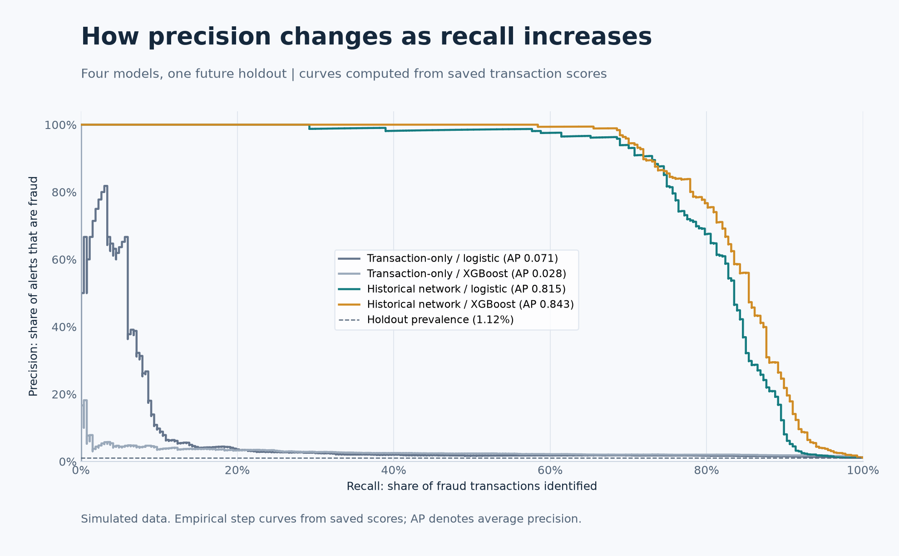
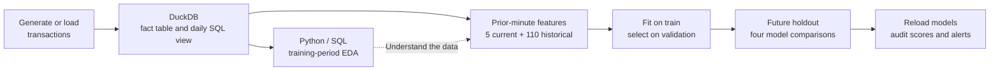
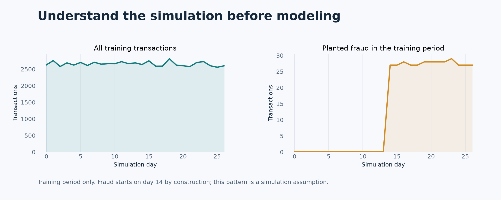
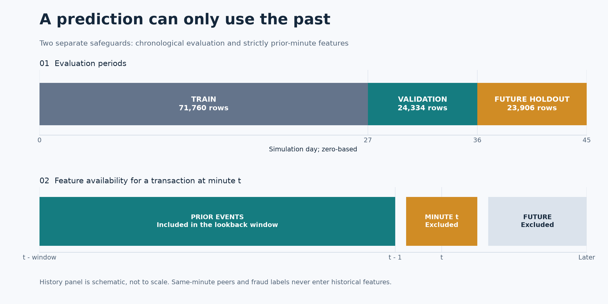

# Follow the Money

**Mobile-wallet fraud analysis with DuckDB, Python, and historical transaction features.**


Can a wallet's recent transaction history reveal risk that a single payment cannot? This project answers that question in a controlled simulation, comparing transaction-only models with models that also observe prior sender and receiver activity.

**120,000 transactions · 115 features · four model comparisons · a future-period holdout**

> All data and results are simulated. They do not measure JazzCash, easypaisa, or any provider's performance. Alerted transaction value is not money recovered or loss prevented.

[Results](#results-and-what-they-mean) · [Quick start](#quick-start) · [Method](#how-the-analysis-works) · [Verification](VERIFICATION.md) · [Limitations](#limitations-and-next-experiments)

## The question

A transfer's amount, channel, and time may look ordinary in isolation. The receiving wallet might nevertheless have collected payments from many counterparties in a short period. Historical features make that context available to the model.

The experiment asks two related questions:

1. Does prior wallet activity improve fraud ranking on later transactions?
2. Does a model that finds more fraud transactions also cover more fraud transaction value?

The second question matters: with a limited review queue, alert precision and value coverage can favor different models.

## Results and what they mean

The held-out period contains **23,906 transactions**, including **267 frauds (1.1169%)** and **710,658.66 simulated units** of fraud transaction value. Every model receives the same budget of 100 alerts across that entire nine-day period.

| Model | Features | PR-AUC¹ | Precision @100 | Fraud value @100 | Value share |
| --- | ---: | ---: | ---: | ---: | ---: |
| Transaction-only logistic regression | 5 | 0.0714 | 23% | 437,069.33 | 61.50% |
| Transaction-only XGBoost | 5 | 0.0278 | 4% | 52,738.65 | 7.42% |
| Historical-network logistic regression | 115 | 0.8155 | 99% | 112,134.26 | 15.78% |
| Historical-network XGBoost | 115 | 0.8428 | 100% | 130,552.82 | 18.37% |

¹ PR-AUC is **average precision**, not trapezoidal integration. Full-precision values and validation trials are in the [tracked metrics snapshot](docs/results/metrics.json).



**Historical context improves ranking in this simulation.** Historical-network XGBoost finds 100 fraud transactions among its top 100 alerts. Its high score reflects deliberately recognizable planted bursts; it is not evidence of production readiness.

**More correct alerts do not necessarily cover more transaction value.** Transaction-only logistic regression ranks several large collector transfers highly, covering 61.50% of fraud transaction value despite only 23 correct alerts. Historical models emphasize clustered receipts, which are often smaller. No value-weighted alert policy was tuned after viewing these results.



<details>
<summary><strong>Metric definitions and interpretation</strong></summary>

- **PR-AUC / average precision:** summarizes the precision–recall tradeoff across score thresholds. Holdout prevalence, 1.1169%, is the no-skill population reference.
- **Precision @100:** fraud transactions divided by 100 among the highest-scored holdout transactions.
- **Fraud value @100:** sum of amount x fraud label in those 100 alerts.
- **Value share:** fraud value @100 divided by fraud transaction value across the full holdout.
- **Ranking ties:** resolved by minute, then transaction ID.
- **Budget:** 100 alerts across all nine holdout days, not 100 per day.

Fraud value is a transaction-based measure. A scam receipt and its onward collector transfer may both be labeled, so the same underlying funds can be counted at multiple stages. These metrics do not establish recovered funds or prevented loss. Scores are used for ranking and have not been calibrated as real-world fraud probabilities.

</details>

## Quick start

Tested with **Python 3.12.10 on Windows x64**. Use Python 3.12 and the pinned dependencies for reproduction. Run from the directory containing this README.

```powershell
python -m venv .venv
.venv/Scripts/python.exe -m pip install -r requirements-lock.txt
.venv/Scripts/python.exe run.py --rows 120000 --seed 42
```

The runner performs tests, generation, loading, EDA, feature engineering, model selection, holdout evaluation, and saved-artifact verification. The reference full run takes approximately two minutes on the tested machine, excluding installation; runtime varies by hardware. Allow several GB of disk space for environments and artifacts. Data-frame memory use grows with row count.

No notebook, account credentials, activation command, or external database server is needed. Network access is required for dependency installation; the analytical pipeline then runs locally.

<details>
<summary><strong>Linux / macOS commands</strong> (not verified on those platforms)</summary>

```bash
python3.12 -m venv .venv
.venv/bin/python -m pip install -r requirements-lock.txt
.venv/bin/python run.py --rows 120000 --seed 42
```

The optional `run.sh` wrapper uses the `python` on your PATH. Prefer the explicit virtual-environment command above.

</details>

To run into separate directories:

```powershell
.venv/Scripts/python.exe run.py --rows 120000 --seed 42 --data-dir experiment/data --out experiment/outputs
```

Default outputs are replaced on rerun. The pipeline requires at least 100,000 transactions. On failure, read `outputs/pipeline.log` and `outputs/run_manifest.json`; the runner stops at the first failed stage. `requirements-lock.txt` pins the tested environment; `requirements.txt` contains development ranges.

## How the analysis works



### 1. Data and exploration

The generator creates 45 days of payments among 5,000 wallets: ordinary activity, busy legitimate merchants, concentrated scam receipts, and occasional onward transfers to collectors. Fraud bursts start on day 14. These are modeling assumptions, not observations about real customers.

The complete dataset has **881 fraud transactions out of 120,000 (0.7342%)**. The loader checks unique IDs, positive finite amounts, supported channels, binary labels, valid wallet IDs, and absence of self-transfers before replacing the existing table.

| Column | Meaning | Used directly as a predictor? |
| --- | --- | --- |
| `transaction_id` | Unique nonnegative event ID | No; joins and ranking ties only |
| `minute` | Integer minutes from simulation start | Only derived hour and weekday |
| `sender_id`, `receiver_id` | Wallet identifiers | No; used to compute history |
| `amount` | Requested amount in simulated units | Yes |
| `channel` | P2P, QR, or BANK | Yes, encoded as indicators |
| `is_fraud` | Simulated binary outcome | No; target and evaluation only |

EDA queries DuckDB from Python and exports daily activity, amount quantiles, and channel summaries. Distribution plots use only the training period; the full-dataset summary is descriptive.



In training, legitimate payments have a median amount of **450.90**, versus **810.57** for fraud, with substantial overlap. P2P accounts for 50,376 of 71,760 training transactions. Channel fraud rates are similar, about 0.48%–0.56%. See the [EDA snapshot](docs/results/eda.json).

### 2. Point-in-time features

The **five transaction features** are requested amount, fractional hour, simulated weekday, and P2P/QR indicators. BANK is the reference channel; simulation day zero is treated as Monday.

The **110 historical features** are the product of:

| Dimension | Values |
| --- | --- |
| Endpoint role: 2 | Current sender's outgoing activity; current receiver's incoming activity |
| Lookback window: 5 | 15 minutes, 1 hour, 6 hours, 1 day, 7 days |
| Measure: 11 | Count; total, mean, max, min and population standard deviation of amount; unique counterparties; P2P and QR counts; amounts above 3,000 and below 300 |

This gives **2 x 5 x 11 = 110**, plus five current attributes: **115 predictors**. They measure activity, value, dispersion, counterparty breadth, and channel mix. Related windows are correlated; these are not 115 independent signals. The amount cutoffs are fixed simulation choices.

For an event at minute **t**, a historical window includes **[t - window, t - 1]**. The entire current minute is excluded, including peers with a lower transaction ID. Empty history becomes zero; count features distinguish an empty window from a genuine zero standard deviation.

For example, the 15-minute history at minute 120 includes minutes 105–119. A payment at minute 120 cannot contribute to its own features or another payment's same-minute history.

No fraud-label history, direct wallet IDs, future balances, or full-dataset graph statistics enter the model. These are **local network aggregates**, not multi-hop graph embeddings or a graph neural network. The [feature dictionary](docs/results/feature_dictionary.json) lists every name and availability rule.

### 3. Temporal evaluation



| Period | Simulation days | Rows | Fraud rows | Prevalence |
| --- | --- | ---: | ---: | ---: |
| Train | 0–26 | 71,760 | 358 | 0.4989% |
| Validation | 27–35 | 24,334 | 256 | 1.0520% |
| Future holdout | 36–44 | 23,906 | 267 | 1.1169% |

Whole minutes remain in one period. Models and preprocessing are fitted only on training data:

- **Logistic regression:** median imputation, standardization, balanced class weights; validation selects C from 0.1 and 1.0.
- **XGBoost:** median imputation, 180 trees, fixed learning rate and sampling settings; validation selects depth 3 or 5.
- **Selection:** validation average precision, separately for each feature set and algorithm. All choices finish before test scoring. The selected models are not refitted on validation.
- **Reproducibility:** seed 42 and one DuckDB feature-generation worker to keep floating-point aggregation order stable. Logistic convergence warnings fail the run.

Earlier validation and test transactions may enter later historical features **without their labels**, matching sequential scoring of an observed stream. This is not a forecast of an entire future batch with frozen history. It assumes earlier events arrive promptly and all training labels are available at the training cutoff.

## Explore and reproduce

<details>
<summary><strong>Query the analytical database from Python</strong></summary>

```python
import duckdb

with duckdb.connect("data/wallet.duckdb", read_only=True) as connection:
    daily = connection.execute("""
        SELECT day, sum(transactions) AS transactions,
               sum(fraud_count) AS frauds, sum(volume) AS volume
        FROM daily_olap
        GROUP BY day
        ORDER BY day
    """).df()

print(daily.head())
```

The database contains `transactions`, the `daily_olap` SQL view, and `model_features`.

</details>

<details>
<summary><strong>Load a compatible CSV instead of generating data</strong></summary>

```powershell
.venv/Scripts/python.exe run.py --csv path/to/transactions.csv --data-dir imported/data --out imported/outputs --train-end-day 27 --test-start-day 36
```

Columns must appear in this order:

```text
transaction_id,minute,sender_id,receiver_id,amount,channel,is_fraud
```

Convert timestamps to integer minutes from a known origin and choose appropriate day cutoffs. At least 100,000 rows and both classes in every split are required. The existing artifact audit also expects every feature to vary, which may not hold for other datasets; review that assumption before adapting it. The full reference run uses generated data; only schema-level tests cover the optional import path.

</details>

<details>
<summary><strong>Run checks or regenerate publication figures</strong></summary>

```powershell
.venv/Scripts/python.exe -m unittest discover -s tests -v
.venv/Scripts/python.exe scripts/verify.py --db data/wallet.duckdb --out outputs
.venv/Scripts/python.exe scripts/visualize.py --results outputs --out docs/assets --snapshot-dir docs/results
```

The visualization script checks saved scores against reported metrics before producing four charts and a compact results snapshot. It does not retrain models or call an image-generation API. Regenerating charts from another experiment requires updating the README's numerical interpretation too.

The cover is AI-generated conceptual artwork. All performance graphics are rendered from measured results with Matplotlib. See [visual provenance and the cover prompt](docs/ASSETS.md).

</details>

## Project map

| File or directory | Purpose |
| --- | --- |
| [run.py](run.py) | Execute all analytical stages and record commands, versions, hashes, and timing |
| [scripts/generate.py](scripts/generate.py) | Reproducible simulated payments and planted fraud |
| [scripts/load.py](scripts/load.py) | Input validation, DuckDB fact table, and analytical view |
| [scripts/eda.py](scripts/eda.py) | Training-period SQL exploration |
| [scripts/features.py](scripts/features.py) | Strictly prior-minute features and their dictionary |
| [scripts/train.py](scripts/train.py) | Validation selection, four saved models, and holdout scores |
| [scripts/verify.py](scripts/verify.py) | Independent feature audit and saved-model checks |
| [scripts/visualize.py](scripts/visualize.py) | Reproducible charts and shareable result snapshots |
| [tests/test_pipeline.py](tests/test_pipeline.py) | Eight behavioral tests for timing, metrics, generation, and loading |
| [docs/assets](docs/assets) | Cover artwork and four tracked explanatory figures |
| [docs/results](docs/results) | Small, tracked evidence files available without running the project |
| [VERIFICATION.md](VERIFICATION.md) | Execution evidence, reproduction commands, and verification scope |

Local outputs include `data/wallet.duckdb`, `outputs/metrics.json`, `outputs/scored_holdout.csv`, four `*_top100.csv` alert lists, four `.joblib` pipelines, EDA exports, and the execution log/manifest. All alert files include the same four model score columns. Load only trusted joblib files.

Large data, model binaries, local environments, and execution outputs are Git-ignored. The small documentation assets and result snapshots are intended to be committed with the source.

## Verification

All eight behavioral tests pass. They cover same-minute exclusion, future-data and label invariance, prefix-versus-batch equivalence, every historical feature against an independent calculation, time boundaries, alert arithmetic, reproducible generation, and invalid-input rejection.

The full artifact audit compares **110 historical features on 55 rows**, checks finiteness and variation, reloads all four models, and reproduces scores, metrics, and alert IDs. Two environments reproduce the final results exactly. See the [audit](docs/results/verification.json), [run summary](docs/results/run-summary.json), and [reproduction record](docs/results/reproduction.json).

These checks support the implemented timing assumptions; they do not establish that a future operational data feed will satisfy those assumptions.

## Limitations and next experiments

- **Synthetic task:** planted patterns are deliberately detectable. Fraud starts on day 14, and collector timing depends on each mule's last burst.
- **Simplified money movement:** no balance-conserving ledger, reversals, identity resolution, or verified customer behavior. Value can count funds at multiple transfer stages.
- **Label and event availability:** training labels are assumed known at the cutoff; ingestion and fraud-reporting delays are not modeled.
- **Limited evaluation:** one seed and one future period; no confidence intervals, repeated temporal backtests, external benchmark, or unseen-wallet study.
- **Limited network scope:** local endpoint aggregates only; no multi-hop paths or cross-role flow matching.
- **Retrospective alert budget:** top 100 across a completed holdout is capacity analysis, not a tested live threshold, daily queue, or intervention policy.
- **Scale and portability:** in-memory feature frames and fitting; large-scale performance and Linux/macOS setup are unverified.

Useful next experiments are delayed-label backtests, unseen-wallet evaluation, stronger legitimate burst scenarios, and a validation-selected alert policy that explicitly trades review volume against transaction value. Each should retain the transaction-only baselines and the same future-period evaluation discipline.
